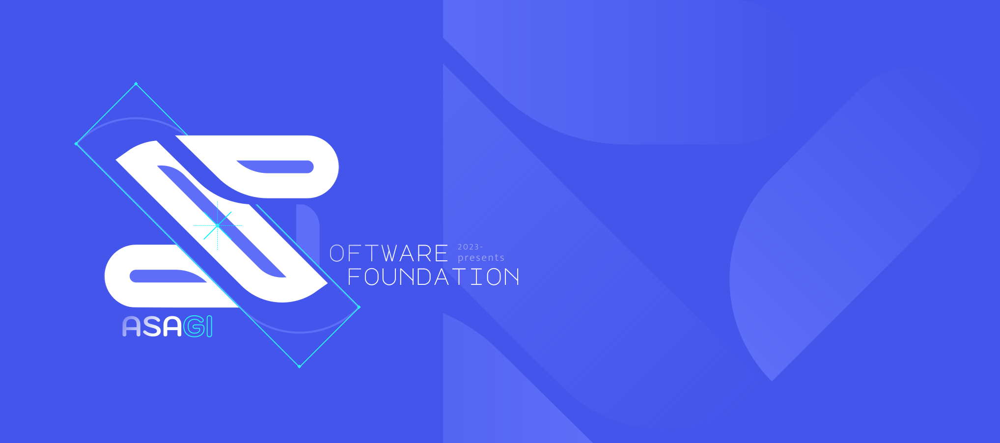

The **[ASAGI-Dev](https://github.com/ASAGI-Dev)** (_ASG_) is a small circle that manage software development. We are a learner that communicate to sharing knowledge to each other, aiming and pursuing to develop functionallity with robust & readability, performance first-class citizens without sacrifice the hoods, documenting a complex code architectures, research and development, user interface/user experience, automation pipeline, and much more. We prioritize to have a comfortable environment without making any noises (blame, pressure, etc). Currently most of works are under private repositories.

[Code of Conduct](https://github.com/ASAGI-Dev/.github?tab=coc-ov-file).
2023-Presents.
